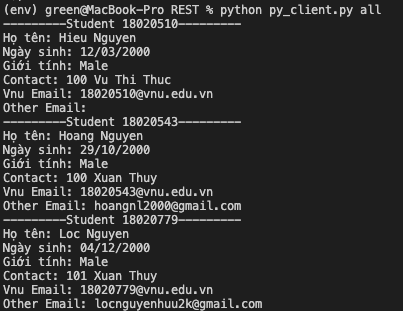
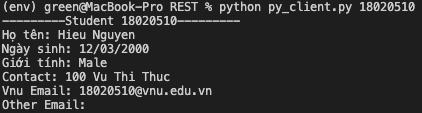
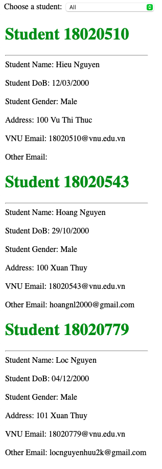
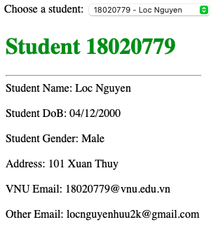

# REST API

## APIs
### Get student info

* url: `/api/getinfo?sid=<student_id|all>`  
    * `sid == 'all'`: Trả về toàn bộ danh sách sv
    * `sid` là mã số của 1 sinh viên: Trả về danh sách chỉ chứa sv có sid đó
    * Còn lại trả về Error 400  

VD Response:
<code>
```
{
    '18020510': {'sid': '18020510', 'dob': '12/03/2000', 'gender': 'Male', 'contacts': {'contact_addr': '100 Vu Thi Thuc', 'contact_name': 'Hieu Nguyen'}, 'name': {'first': 'Hieu', 'last': 'Nguyen'}, 'emails': {'vnu_mail': '18020510@vnu.edu.vn', 'other_mail': ''}},  

    '18020543': {'sid': '18020543', 'dob': '29/10/2000', 'gender': 'Male', 'contacts': {'contact_addr': '100 Xuan Thuy', 'contact_name': 'Hoang Nguyen'}, 'name': {'first': 'Hoang', 'last': 'Nguyen'}, 'emails': {'vnu_mail': '18020543@vnu.edu.vn', 'other_mail': 'hoangnl2000@gmail.com'}},  

    '18020779': {'sid': '18020779', 'dob': '04/12/2000', 'gender': 'Male', 'contacts': {'contact_addr': '101 Xuan Thuy', 'contact_name': 'Loc Nguyen'}, 'name': {'first': 'Loc', 'last': 'Nguyen'}, 'emails': {'vnu_mail': '18020779@vnu.edu.vn', 'other_mail': 'locnguyenhuu2k@gmail.com'}}
}
``` 

## Các bước chạy:
1. Sử dụng python 3 install flask, request
2. Chạy các command sau để khởi động server:
    * export FLASH_APP=app.py
    * export FLASH_ENV=development
    * flask run
3. Chạy client:
    * Web client: Truy cập đến 127.0.0.1:5000 (hoặc port khi run flask)
    * Desktop client: Chạy command: `python py_client all` hoặc `python py_client 18020510`
    
## Ảnh







