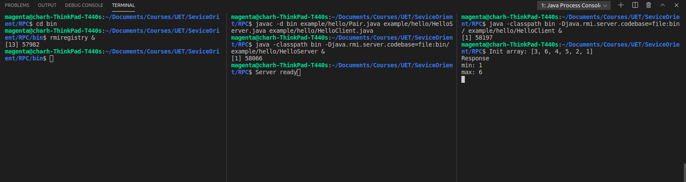

# Bài tập tuần 2

## Thành viên
* Nguyễn Lê Hoàng - 18020543
* Nguyễn Hữu Lộc - 18020779
* Nguyễn Ngọc Hiếu - 18020510
  
## Các bước chạy

1. Compile code:

> javac -d bin example/hello/Pair.java example/hello/HelloServer.java example/hello/ HelloClient.java

2. Run rmiregistry ở thư mục `bin`
> cd bin  
> rmiregistry &

3. Run Server
> java -classpath bin -Djava.rmi.server.codebase=file:bin/ example.hello.HelloServer &

4. Run Client
> java  -classpath bin example.hello.HelloClient

## Ảnh output

